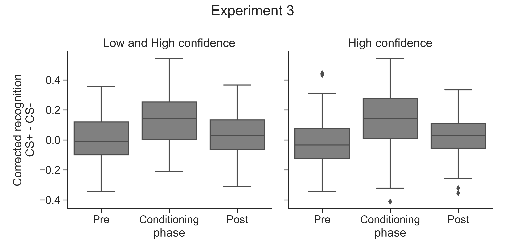

# Experiment 3

     

### Normality check
| confidence   |        W |     pval | normal   |
|--------------|----------|----------|----------|
| Low_and_High | 9.94e-01 | 7.26e-02 | True     |
| High         | 9.79e-01 | 3.05e-06 | False    |

## Low confidence
### ANOVA
| Source            |   ddof1 |   ddof2 |        F |    p-unc |      np2 | sig   |
|-------------------|---------|---------|----------|----------|----------|-------|
| phase             |       2 |     154 | 3.57e+01 | 1.81e-13 | 3.17e-01 | ***   |
| condition         |       1 |      77 | 1.78e+01 | 6.50e-05 | 1.88e-01 | ***   |
| phase * condition |       2 |     154 | 2.21e+01 | 3.59e-09 | 2.23e-01 | ***   |

### T-tests
Low and High confidence corrected recognition CS+ vs. CS- ttests
|   phase |        T |   dof | tail      |    p-val |   cohen-d |     BF10 | sig   |
|---------|----------|-------|-----------|----------|-----------|----------|-------|
|       1 | 1.73e-01 |    77 | two-sided | 8.63e-01 |  1.89e-02 | 2.54e-01 |       |
|       2 | 6.60e+00 |    77 | two-sided | 4.78e-09 |  7.74e-01 | 4.73e+06 | ***   |
|       3 | 1.90e+00 |    77 | two-sided | 6.07e-02 |  1.90e-01 | 1.38e+00 | ~     |

## High confidence
### Anova
| Source            |   ddof1 |   ddof2 |        F |    p-unc |      np2 | sig   |
|-------------------|---------|---------|----------|----------|----------|-------|
| phase             |       2 |     154 | 1.77e+01 | 1.18e-07 | 1.87e-01 | ***   |
| condition         |       1 |      77 | 1.07e+01 | 1.62e-03 | 1.22e-01 | **    |
| phase * condition |       2 |     154 | 1.95e+01 | 2.83e-08 | 2.02e-01 | ***   |

### T-tests
|   phase |         T |   dof | tail      |    p-val |   cohen-d |     BF10 | sig   |
|---------|-----------|-------|-----------|----------|-----------|----------|-------|
|       1 | -9.85e-01 |    77 | two-sided | 3.28e-01 |  1.00e-01 | 3.98e-01 |       |
|       2 |  5.39e+00 |    77 | two-sided | 7.51e-07 |  6.41e-01 | 3.88e+04 | ***   |
|       3 |  1.63e+00 |    77 | two-sided | 1.08e-01 |  1.70e-01 | 8.78e-01 |       |

### Wilcoxon sign-ranked test
|   phase | test     |    p-val |     CLES | sig   |
|---------|----------|----------|----------|-------|
|       1 | Wilcoxon | 1.41e-01 | 4.72e-01 |       |
|       2 | Wilcoxon | 2.74e-06 | 6.96e-01 | ***   |
|       3 | Wilcoxon | 7.43e-02 | 5.38e-01 | ~     |

## Identifying outliers in the CS+ vs. CS- difference 

     

### Low and High confidence ttests without ouliers
|   phase |        T |   dof | tail      |    p-val |   cohen-d |     BF10 | sig   |
|---------|----------|-------|-----------|----------|-----------|----------|-------|
|       1 | 1.73e-01 |    77 | two-sided | 8.63e-01 |  1.89e-02 | 2.54e-01 |       |
|       2 | 6.60e+00 |    77 | two-sided | 4.78e-09 |  7.74e-01 | 4.73e+06 | ***   |
|       3 | 1.90e+00 |    77 | two-sided | 6.07e-02 |  1.90e-01 | 1.38e+00 | ~     |

### High confidence ttests without outliers
|   phase |         T |   dof | tail      |    p-val |   cohen-d |     BF10 | sig   |
|---------|-----------|-------|-----------|----------|-----------|----------|-------|
|       1 | -1.86e+00 |    75 | two-sided | 6.73e-02 |  1.72e-01 | 1.29e+00 | ~     |
|       2 |  5.89e+00 |    76 | two-sided | 1.01e-07 |  6.88e-01 | 2.61e+05 | ***   |
|       3 |  2.38e+00 |    75 | two-sided | 1.98e-02 |  2.36e-01 | 3.55e+00 | *     |

## Experiment 3 MLM
### Low and High confidence
| Effect                |   Estimate |   z value |    p-val | sig   |
|-----------------------|------------|-----------|----------|-------|
| condition1:phaseone   |  -2.11e-02 | -2.66e-01 | 7.91e-01 |       |
| condition1:phasetwo   |   6.97e-01 |  8.62e+00 | 6.74e-18 | ***   |
| condition1:phasethree |   1.31e-01 |  1.70e+00 | 8.88e-02 | ~     |

### High confidence
| Effect                |   Estimate |   z value |    p-val | sig   |
|-----------------------|------------|-----------|----------|-------|
| condition1:phaseone   |  -1.82e-01 | -1.92e+00 | 5.52e-02 | ~     |
| condition1:phasetwo   |   5.21e-01 |  5.47e+00 | 4.52e-08 | ***   |
| condition1:phasethree |   8.81e-02 |  9.10e-01 | 3.63e-01 |       |
