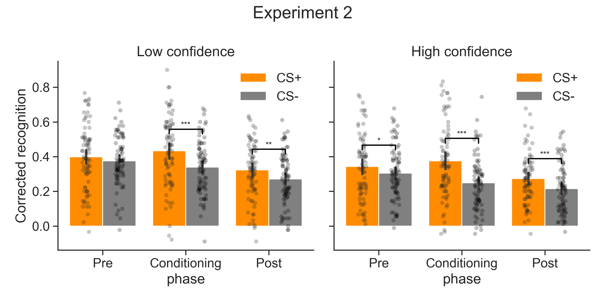
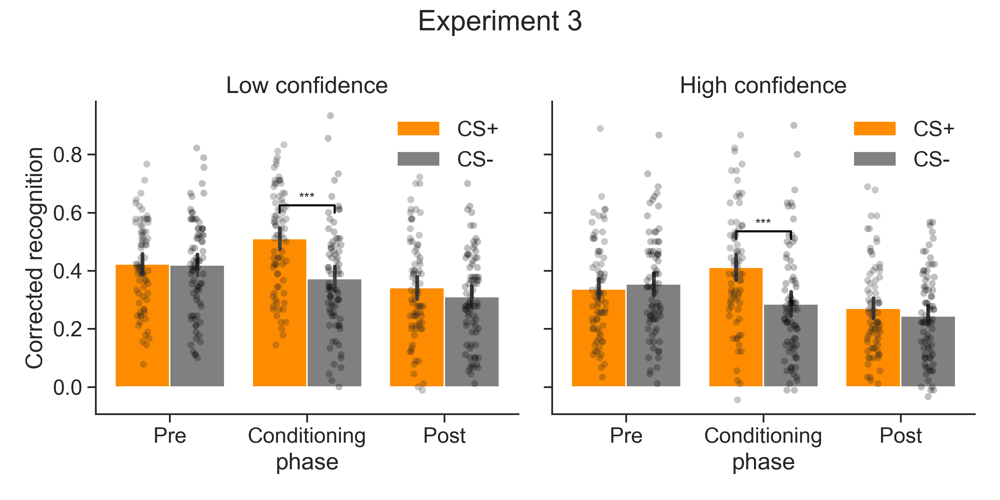
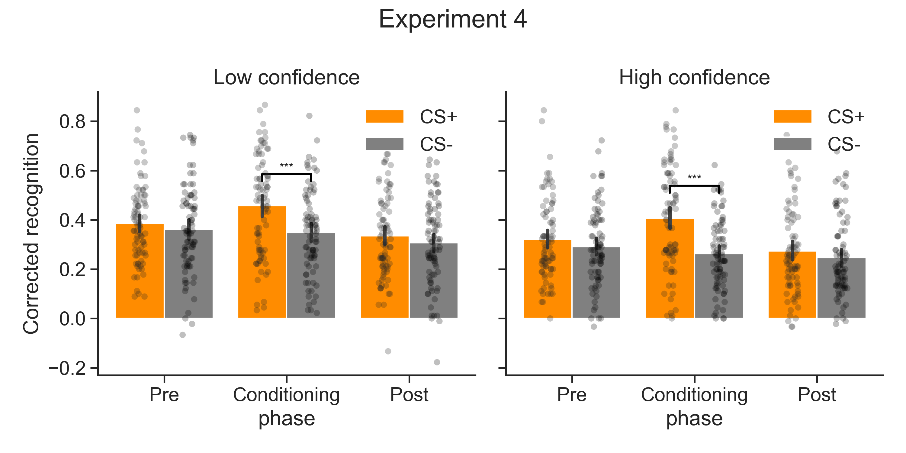

# kable_replication
Replicating analyses for this project: https://osf.io/qpm3t/

# Experiment 2

     

## Low confidence
### ANOVA
| Source            |   ddof1 |   ddof2 |        F |    p-unc |      np2 | sig   |
|-------------------|---------|---------|----------|----------|----------|-------|
| phase             |       2 |     158 | 2.69e+01 | 9.15e-11 | 2.54e-01 | ***   |
| condition         |       1 |      79 | 1.70e+01 | 9.03e-05 | 1.77e-01 | ***   |
| phase * condition |       2 |     158 | 6.66e+00 | 1.67e-03 | 7.77e-02 | **    |

### T-tests
|        T |   dof | tail      |    p-val |   cohen-d |     BF10 | sig   |
|----------|-------|-----------|----------|-----------|----------|-------|
| 1.28e+00 |    79 | two-sided | 2.06e-01 |  1.37e-01 | 2.69e-01 |       |
| 4.89e+00 |    79 | two-sided | 5.21e-06 |  5.23e-01 | 3.11e+03 | ***   |
| 3.32e+00 |    79 | two-sided | 1.37e-03 |  3.32e-01 | 1.82e+01 | **    |

## High confidence
### Anova
| Source            |   ddof1 |   ddof2 |        F |    p-unc |      np2 | sig   |
|-------------------|---------|---------|----------|----------|----------|-------|
| phase             |       2 |     158 | 1.75e+01 | 1.38e-07 | 1.81e-01 | ***   |
| condition         |       1 |      79 | 2.99e+01 | 5.07e-07 | 2.75e-01 | ***   |
| phase * condition |       2 |     158 | 1.15e+01 | 2.16e-05 | 1.27e-01 | ***   |

### T-tests
|        T |   dof | tail      |    p-val |   cohen-d |     BF10 | sig   |
|----------|-------|-----------|----------|-----------|----------|-------|
| 2.31e+00 |    79 | two-sided | 2.36e-02 |  2.22e-01 | 1.50e+00 | *     |
| 6.08e+00 |    79 | two-sided | 4.10e-08 |  6.86e-01 | 3.03e+05 | ***   |
| 3.88e+00 |    79 | two-sided | 2.12e-04 |  4.09e-01 | 9.93e+01 | ***   |

# Experiment 3

     

## Low confidence
### ANOVA
| Source            |   ddof1 |   ddof2 |        F |    p-unc |      np2 | sig   |
|-------------------|---------|---------|----------|----------|----------|-------|
| phase             |       2 |     154 | 3.57e+01 | 1.81e-13 | 3.17e-01 | ***   |
| condition         |       1 |      77 | 1.78e+01 | 6.50e-05 | 1.88e-01 | ***   |
| phase * condition |       2 |     154 | 2.21e+01 | 3.59e-09 | 2.23e-01 | ***   |

### T-tests
|        T |   dof | tail      |    p-val |   cohen-d |     BF10 | sig   |
|----------|-------|-----------|----------|-----------|----------|-------|
| 1.73e-01 |    77 | two-sided | 8.63e-01 |  1.89e-02 | 1.27e-01 |       |
| 6.60e+00 |    77 | two-sided | 4.78e-09 |  7.74e-01 | 2.36e+06 | ***   |
| 1.90e+00 |    77 | two-sided | 6.07e-02 |  1.90e-01 | 6.91e-01 |       |

## High confidence
### Anova
| Source            |   ddof1 |   ddof2 |        F |    p-unc |      np2 | sig   |
|-------------------|---------|---------|----------|----------|----------|-------|
| phase             |       2 |     154 | 1.77e+01 | 1.18e-07 | 1.87e-01 | ***   |
| condition         |       1 |      77 | 1.07e+01 | 1.62e-03 | 1.22e-01 | **    |
| phase * condition |       2 |     154 | 1.95e+01 | 2.83e-08 | 2.02e-01 | ***   |

### T-tests
|         T |   dof | tail      |    p-val |   cohen-d |     BF10 | sig   |
|-----------|-------|-----------|----------|-----------|----------|-------|
| -9.85e-01 |    77 | two-sided | 3.28e-01 |  1.00e-01 | 1.99e-01 |       |
|  5.39e+00 |    77 | two-sided | 7.51e-07 |  6.41e-01 | 1.94e+04 | ***   |
|  1.63e+00 |    77 | two-sided | 1.08e-01 |  1.70e-01 | 4.39e-01 |       |

# Experiment 4

     

## Low confidence
### ANOVA
| Source            |   ddof1 |   ddof2 |        F |    p-unc |      np2 | sig   |
|-------------------|---------|---------|----------|----------|----------|-------|
| phase             |       2 |     164 | 1.82e+01 | 7.30e-08 | 1.82e-01 | ***   |
| condition         |       1 |      82 | 1.76e+01 | 6.82e-05 | 1.77e-01 | ***   |
| phase * condition |       2 |     164 | 1.02e+01 | 6.77e-05 | 1.10e-01 | ***   |

### T-tests
|        T |   dof | tail      |    p-val |   cohen-d |     BF10 | sig   |
|----------|-------|-----------|----------|-----------|----------|-------|
| 1.37e+00 |    82 | two-sided | 1.76e-01 |  1.37e-01 | 2.96e-01 |       |
| 5.75e+00 |    82 | two-sided | 1.48e-07 |  5.77e-01 | 8.85e+04 | ***   |
| 1.71e+00 |    82 | two-sided | 9.11e-02 |  1.65e-01 | 4.87e-01 |       |

## High confidence
### Anova
| Source            |   ddof1 |   ddof2 |        F |    p-unc |      np2 | sig   |
|-------------------|---------|---------|----------|----------|----------|-------|
| phase             |       2 |     164 | 1.15e+01 | 2.13e-05 | 1.23e-01 | ***   |
| condition         |       1 |      82 | 2.45e+01 | 3.94e-06 | 2.30e-01 | ***   |
| phase * condition |       2 |     164 | 2.17e+01 | 4.26e-09 | 2.09e-01 | ***   |

### T-tests
|        T |   dof | tail      |    p-val |   cohen-d |     BF10 | sig   |
|----------|-------|-----------|----------|-----------|----------|-------|
| 1.73e+00 |    82 | two-sided | 8.83e-02 |  1.90e-01 | 4.99e-01 |       |
| 7.24e+00 |    82 | two-sided | 2.15e-10 |  7.91e-01 | 4.56e+07 | ***   |
| 1.75e+00 |    82 | two-sided | 8.41e-02 |  1.60e-01 | 5.18e-01 |       |
