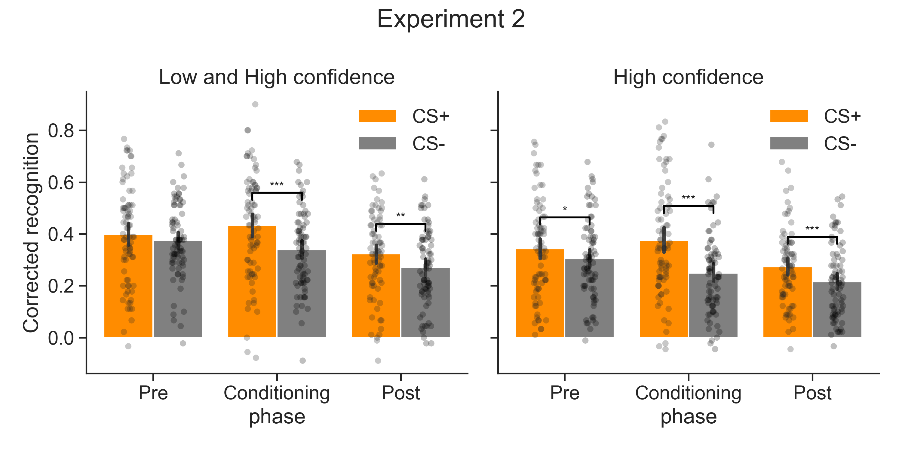
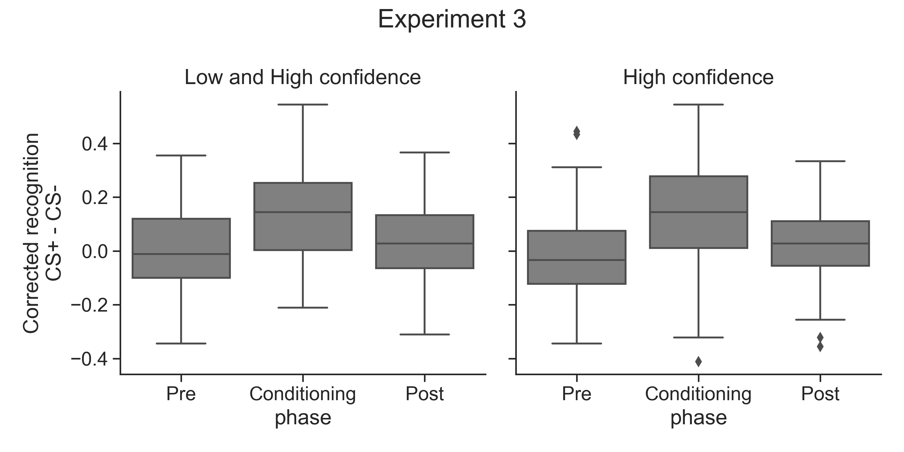
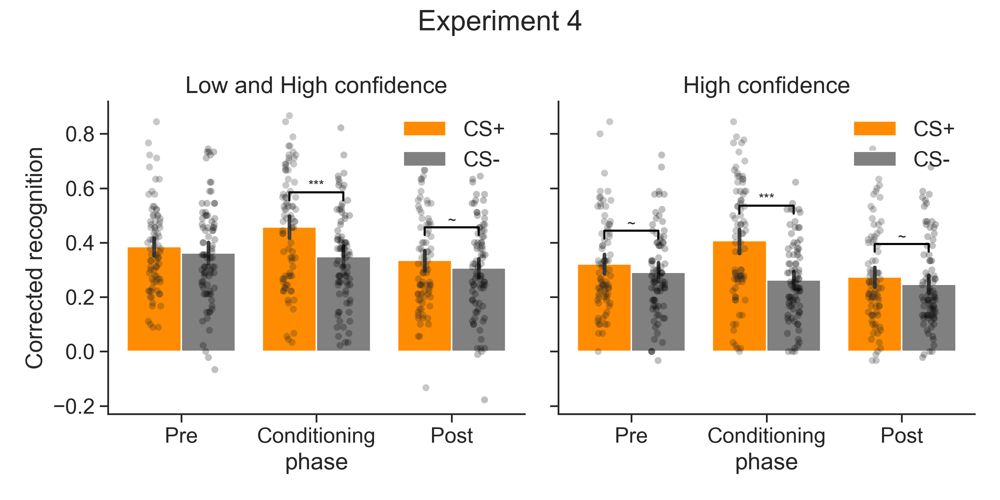

# kable_replication
Replicating analyses for this project: https://osf.io/qpm3t/

# Experiment 2

     

### Normality check
| confidence   |        W |     pval | normal   |
|--------------|----------|----------|----------|
| Low_and_High | 9.97e-01 | 6.80e-01 | True     |
| High         | 9.76e-01 | 4.31e-07 | False    |

## Low and High confidence
### ANOVA
| Source            |   ddof1 |   ddof2 |        F |    p-unc |      np2 | sig   |
|-------------------|---------|---------|----------|----------|----------|-------|
| phase             |       2 |     158 | 2.69e+01 | 9.15e-11 | 2.54e-01 | ***   |
| condition         |       1 |      79 | 1.70e+01 | 9.03e-05 | 1.77e-01 | ***   |
| phase * condition |       2 |     158 | 6.66e+00 | 1.67e-03 | 7.77e-02 | **    |

### T-tests
|   phase |        T |   dof | tail      |    p-val |   cohen-d |     BF10 | sig   |
|---------|----------|-------|-----------|----------|-----------|----------|-------|
|       1 | 1.28e+00 |    79 | two-sided | 2.06e-01 |  1.37e-01 | 5.38e-01 |       |
|       2 | 4.89e+00 |    79 | two-sided | 5.21e-06 |  5.23e-01 | 6.22e+03 | ***   |
|       3 | 3.32e+00 |    79 | two-sided | 1.37e-03 |  3.32e-01 | 3.64e+01 | **    |

## High confidence
### Anova
| Source            |   ddof1 |   ddof2 |        F |    p-unc |      np2 | sig   |
|-------------------|---------|---------|----------|----------|----------|-------|
| phase             |       2 |     158 | 1.75e+01 | 1.38e-07 | 1.81e-01 | ***   |
| condition         |       1 |      79 | 2.99e+01 | 5.07e-07 | 2.75e-01 | ***   |
| phase * condition |       2 |     158 | 1.15e+01 | 2.16e-05 | 1.27e-01 | ***   |

### T-tests
|   phase |        T |   dof | tail      |    p-val |   cohen-d |     BF10 | sig   |
|---------|----------|-------|-----------|----------|-----------|----------|-------|
|       1 | 2.31e+00 |    79 | two-sided | 2.36e-02 |  2.22e-01 | 2.99e+00 | *     |
|       2 | 6.08e+00 |    79 | two-sided | 4.10e-08 |  6.86e-01 | 6.06e+05 | ***   |
|       3 | 3.88e+00 |    79 | two-sided | 2.12e-04 |  4.09e-01 | 1.99e+02 | ***   |

### Wilcoxon sign-ranked test
|   phase | test     |    p-val |     CLES | sig   |
|---------|----------|----------|----------|-------|
|       1 | Wilcoxon | 1.25e-02 | 5.57e-01 | *     |
|       2 | Wilcoxon | 2.90e-07 | 6.79e-01 | ***   |
|       3 | Wilcoxon | 3.61e-04 | 6.19e-01 | ***   |

## Identifying outliers in the CS+ vs. CS- difference 

     

### Low and High confidence ttests without ouliers
|   phase |        T |   dof | tail      |    p-val |   cohen-d |     BF10 | sig   |
|---------|----------|-------|-----------|----------|-----------|----------|-------|
|       1 | 1.76e+00 |    76 | two-sided | 8.19e-02 |  1.74e-01 | 1.09e+00 | ~     |
|       2 | 4.89e+00 |    79 | two-sided | 5.21e-06 |  5.23e-01 | 6.22e+03 | ***   |
|       3 | 3.88e+00 |    72 | two-sided | 2.28e-04 |  3.34e-01 | 1.92e+02 | ***   |

### High confidence ttests without outliers
|   phase |        T |   dof | tail      |    p-val |   cohen-d |     BF10 | sig   |
|---------|----------|-------|-----------|----------|-----------|----------|-------|
|       1 | 3.23e+00 |    77 | two-sided | 1.80e-03 |  2.87e-01 | 2.88e+01 | **    |
|       2 | 6.08e+00 |    79 | two-sided | 4.10e-08 |  6.86e-01 | 6.06e+05 | ***   |
|       3 | 3.88e+00 |    79 | two-sided | 2.12e-04 |  4.09e-01 | 1.99e+02 | ***   |

## Experiment 2 MLM
### Low and High confidence
| Effect                |   Estimate |   z value |   Pr(>|z|) | sig   |
|-----------------------|------------|-----------|------------|-------|
| condition1:phaseone   |   1.08e-01 |  1.41e+00 |   1.58e-01 |       |
| condition1:phasetwo   |   4.13e-01 |  5.41e+00 |   6.33e-08 | ***   |
| condition1:phasethree |   2.11e-01 |  2.83e+00 |   4.64e-03 | **    |

### High confidence
| Effect                |   Estimate |   z value |   Pr(>|z|) | sig   |
|-----------------------|------------|-----------|------------|-------|
| condition1:phaseone   |   1.92e-01 |  2.12e+00 |   3.40e-02 | *     |
| condition1:phasetwo   |   6.00e-01 |  6.59e+00 |   4.51e-11 | ***   |
| condition1:phasethree |   3.15e-01 |  3.40e+00 |   6.66e-04 | ***   |

---
# Experiment 3

     

### Normality check
| confidence   |        W |     pval | normal   |
|--------------|----------|----------|----------|
| Low_and_High | 9.94e-01 | 7.26e-02 | True     |
| High         | 9.79e-01 | 3.05e-06 | False    |

## Low confidence
### ANOVA
| Source            |   ddof1 |   ddof2 |        F |    p-unc |      np2 | sig   |
|-------------------|---------|---------|----------|----------|----------|-------|
| phase             |       2 |     154 | 3.57e+01 | 1.81e-13 | 3.17e-01 | ***   |
| condition         |       1 |      77 | 1.78e+01 | 6.50e-05 | 1.88e-01 | ***   |
| phase * condition |       2 |     154 | 2.21e+01 | 3.59e-09 | 2.23e-01 | ***   |

### T-tests
Low and High confidence corrected recognition CS+ vs. CS- ttests
|   phase |        T |   dof | tail      |    p-val |   cohen-d |     BF10 | sig   |
|---------|----------|-------|-----------|----------|-----------|----------|-------|
|       1 | 1.73e-01 |    77 | two-sided | 8.63e-01 |  1.89e-02 | 2.54e-01 |       |
|       2 | 6.60e+00 |    77 | two-sided | 4.78e-09 |  7.74e-01 | 4.73e+06 | ***   |
|       3 | 1.90e+00 |    77 | two-sided | 6.07e-02 |  1.90e-01 | 1.38e+00 | ~     |

## High confidence
### Anova
| Source            |   ddof1 |   ddof2 |        F |    p-unc |      np2 | sig   |
|-------------------|---------|---------|----------|----------|----------|-------|
| phase             |       2 |     154 | 1.77e+01 | 1.18e-07 | 1.87e-01 | ***   |
| condition         |       1 |      77 | 1.07e+01 | 1.62e-03 | 1.22e-01 | **    |
| phase * condition |       2 |     154 | 1.95e+01 | 2.83e-08 | 2.02e-01 | ***   |

### T-tests
|   phase |         T |   dof | tail      |    p-val |   cohen-d |     BF10 | sig   |
|---------|-----------|-------|-----------|----------|-----------|----------|-------|
|       1 | -9.85e-01 |    77 | two-sided | 3.28e-01 |  1.00e-01 | 3.98e-01 |       |
|       2 |  5.39e+00 |    77 | two-sided | 7.51e-07 |  6.41e-01 | 3.88e+04 | ***   |
|       3 |  1.63e+00 |    77 | two-sided | 1.08e-01 |  1.70e-01 | 8.78e-01 |       |

### Wilcoxon sign-ranked test
|   phase | test     |    p-val |     CLES | sig   |
|---------|----------|----------|----------|-------|
|       1 | Wilcoxon | 1.41e-01 | 4.72e-01 |       |
|       2 | Wilcoxon | 2.74e-06 | 6.96e-01 | ***   |
|       3 | Wilcoxon | 7.43e-02 | 5.38e-01 | ~     |

## Identifying outliers in the CS+ vs. CS- difference 

     

### Low and High confidence ttests without ouliers
|   phase |        T |   dof | tail      |    p-val |   cohen-d |     BF10 | sig   |
|---------|----------|-------|-----------|----------|-----------|----------|-------|
|       1 | 1.73e-01 |    77 | two-sided | 8.63e-01 |  1.89e-02 | 2.54e-01 |       |
|       2 | 6.60e+00 |    77 | two-sided | 4.78e-09 |  7.74e-01 | 4.73e+06 | ***   |
|       3 | 1.90e+00 |    77 | two-sided | 6.07e-02 |  1.90e-01 | 1.38e+00 | ~     |

### High confidence ttests without outliers
|   phase |         T |   dof | tail      |    p-val |   cohen-d |     BF10 | sig   |
|---------|-----------|-------|-----------|----------|-----------|----------|-------|
|       1 | -1.86e+00 |    75 | two-sided | 6.73e-02 |  1.72e-01 | 1.29e+00 | ~     |
|       2 |  5.89e+00 |    76 | two-sided | 1.01e-07 |  6.88e-01 | 2.61e+05 | ***   |
|       3 |  2.38e+00 |    75 | two-sided | 1.98e-02 |  2.36e-01 | 3.55e+00 | *     |

## Experiment 3 MLM
### Low and High confidence
| Effect                |   Estimate |   z value |   Pr(>|z|) | sig   |
|-----------------------|------------|-----------|------------|-------|
| condition1:phaseone   |  -2.11e-02 | -2.66e-01 |   7.91e-01 |       |
| condition1:phasetwo   |   6.97e-01 |  8.62e+00 |   6.74e-18 | ***   |
| condition1:phasethree |   1.31e-01 |  1.70e+00 |   8.88e-02 | ~     |

### High confidence
| Effect                |   Estimate |   z value |   Pr(>|z|) | sig   |
|-----------------------|------------|-----------|------------|-------|
| condition1:phaseone   |  -1.82e-01 | -1.92e+00 |   5.52e-02 | ~     |
| condition1:phasetwo   |   5.21e-01 |  5.47e+00 |   4.52e-08 | ***   |
| condition1:phasethree |   8.81e-02 |  9.10e-01 |   3.63e-01 |       |

---
# Experiment 4

     

### Normality check
| confidence   |        W |     pval | normal   |
|--------------|----------|----------|----------|
| Low_and_High | 9.95e-01 | 8.04e-02 | True     |
| High         | 9.73e-01 | 5.19e-08 | False    |

## Low confidence
### ANOVA
| Source            |   ddof1 |   ddof2 |        F |    p-unc |      np2 | sig   |
|-------------------|---------|---------|----------|----------|----------|-------|
| phase             |       2 |     164 | 1.82e+01 | 7.30e-08 | 1.82e-01 | ***   |
| condition         |       1 |      82 | 1.76e+01 | 6.82e-05 | 1.77e-01 | ***   |
| phase * condition |       2 |     164 | 1.02e+01 | 6.77e-05 | 1.10e-01 | ***   |

### T-tests
|   phase |        T |   dof | tail      |    p-val |   cohen-d |     BF10 | sig   |
|---------|----------|-------|-----------|----------|-----------|----------|-------|
|       1 | 1.37e+00 |    82 | two-sided | 1.76e-01 |  1.37e-01 | 5.92e-01 |       |
|       2 | 5.75e+00 |    82 | two-sided | 1.48e-07 |  5.77e-01 | 1.77e+05 | ***   |
|       3 | 1.71e+00 |    82 | two-sided | 9.11e-02 |  1.65e-01 | 9.74e-01 | ~     |

## High confidence
### Anova
| Source            |   ddof1 |   ddof2 |        F |    p-unc |      np2 | sig   |
|-------------------|---------|---------|----------|----------|----------|-------|
| phase             |       2 |     164 | 1.15e+01 | 2.13e-05 | 1.23e-01 | ***   |
| condition         |       1 |      82 | 2.45e+01 | 3.94e-06 | 2.30e-01 | ***   |
| phase * condition |       2 |     164 | 2.17e+01 | 4.26e-09 | 2.09e-01 | ***   |

### T-tests
|   phase |        T |   dof | tail      |    p-val |   cohen-d |     BF10 | sig   |
|---------|----------|-------|-----------|----------|-----------|----------|-------|
|       1 | 1.73e+00 |    82 | two-sided | 8.83e-02 |  1.90e-01 | 9.98e-01 | ~     |
|       2 | 7.24e+00 |    82 | two-sided | 2.15e-10 |  7.91e-01 | 9.12e+07 | ***   |
|       3 | 1.75e+00 |    82 | two-sided | 8.41e-02 |  1.60e-01 | 1.04e+00 | ~     |

### Wilcoxon sign-ranked test
|   phase | test     |    p-val |     CLES | sig   |
|---------|----------|----------|----------|-------|
|       1 | Wilcoxon | 1.67e-01 | 5.41e-01 |       |
|       2 | Wilcoxon | 7.28e-09 | 7.04e-01 | ***   |
|       3 | Wilcoxon | 9.84e-02 | 5.53e-01 | ~     |

## Identifying outliers in the CS+ vs. CS- difference 

     

### Low and High confidence ttests without ouliers
|   phase |        T |   dof | tail      |    p-val |   cohen-d |     BF10 | sig   |
|---------|----------|-------|-----------|----------|-----------|----------|-------|
|       1 | 1.46e+00 |    80 | two-sided | 1.50e-01 |  1.38e-01 | 6.74e-01 |       |
|       2 | 5.75e+00 |    82 | two-sided | 1.48e-07 |  5.77e-01 | 1.77e+05 | ***   |
|       3 | 1.71e+00 |    82 | two-sided | 9.11e-02 |  1.65e-01 | 9.74e-01 | ~     |

### High confidence ttests without outliers
|   phase |        T |   dof | tail      |    p-val |   cohen-d |     BF10 | sig   |
|---------|----------|-------|-----------|----------|-----------|----------|-------|
|       1 | 1.60e+00 |    79 | two-sided | 1.13e-01 |  1.58e-01 | 8.40e-01 |       |
|       2 | 7.24e+00 |    82 | two-sided | 2.15e-10 |  7.91e-01 | 9.12e+07 | ***   |
|       3 | 1.48e+00 |    81 | two-sided | 1.41e-01 |  1.31e-01 | 6.98e-01 |       |

## Experiment 4 MLM
### Low and High confidence
| Effect                |   Estimate |   z value |   Pr(>|z|) | sig   |
|-----------------------|------------|-----------|------------|-------|
| condition1:phaseone   |   9.08e-02 |  1.22e+00 |   2.22e-01 |       |
| condition1:phasetwo   |   5.32e-01 |  7.01e+00 |   2.46e-12 | ***   |
| condition1:phasethree |   1.30e-01 |  1.77e+00 |   7.65e-02 | ~     |

### High confidence
| Effect                |   Estimate |   z value |   Pr(>|z|) | sig   |
|-----------------------|------------|-----------|------------|-------|
| condition1:phaseone   |   8.18e-02 |  9.37e-01 |   3.49e-01 |       |
| condition1:phasetwo   |   6.24e-01 |  7.15e+00 |   8.84e-13 | ***   |
| condition1:phasethree |   8.76e-02 |  9.91e-01 |   3.22e-01 |       |

