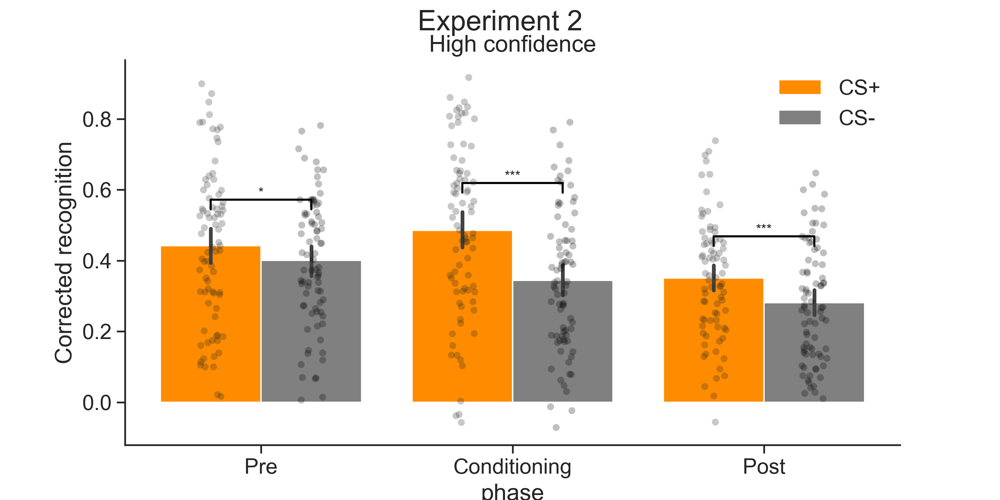
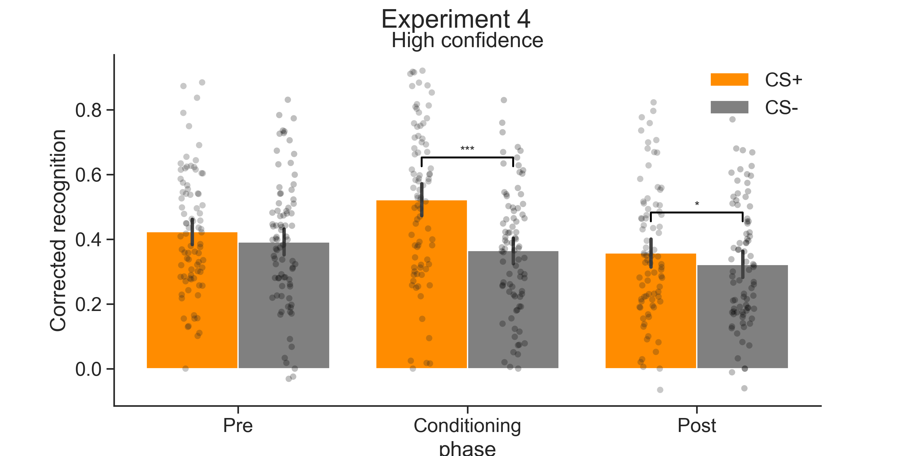

# Experiment 2 and 4 using the author's approach of high confidence in this approach, all low confidence old responses (2) are removed prior to analysis

# Experiment 2

In experiment 2 there were 5851 trials removed

     

## Author method high confidence
High confidence corrected recognition CS+ vs. CS- ttests
|   phase |        T |   dof | tail      |    p-val |   cohen-d |     BF10 | sig   |
|---------|----------|-------|-----------|----------|-----------|----------|-------|
|       1 | 2.00e+00 |    79 | two-sided | 4.91e-02 |  2.03e-01 | 1.63e+00 | *     |
|       2 | 5.73e+00 |    79 | two-sided | 1.78e-07 |  6.41e-01 | 1.51e+05 | ***   |
|       3 | 4.14e+00 |    79 | two-sided | 8.65e-05 |  4.15e-01 | 4.55e+02 | ***   |

# Experiment 4

In experiment 4 there were 6205 trials removed

     

## Author method high confidence
High confidence corrected recognition CS+ vs. CS- ttests
|   phase |        T |   dof | tail      |    p-val |   cohen-d |     BF10 | sig   |
|---------|----------|-------|-----------|----------|-----------|----------|-------|
|       1 | 1.61e+00 |    82 | two-sided | 1.11e-01 |  1.65e-01 | 8.34e-01 |       |
|       2 | 7.26e+00 |    82 | two-sided | 1.99e-10 |  7.32e-01 | 9.80e+07 | ***   |
|       3 | 2.01e+00 |    82 | two-sided | 4.74e-02 |  1.82e-01 | 1.65e+00 | *     |